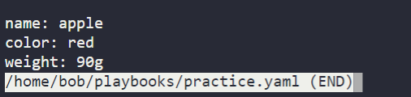

# Ansible_lab

## Lab 1 : YAML

```
Q. which of the following character is used to separate key value pair in yaml?
Ans: Colon
```

```
Q. how to create array in yaml file?
Ans:
    to create an array we map scalar value (key) to the sequence value(array)
    
ex. multi line
    key1:
        - value 1
        - value 2
        - value 3
        - value 4
        - value 5

ex. single line
    key: [value 1,value 2,value 3,value 4,value 5]

```

```
Q. Dataypes in YAML
Ans: there are three types of dataypes in yaml
    1. scalars
    2. sequence
    3. mapping
```

```
Q. How to define properties in yaml
Ans: to define a property 

    ex. property1 : value1
```



```

```


